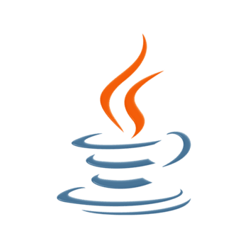

# Hi 👋 I'm Ranjith

🚀 Java Developer
☁️ DevOps Learner
🐍 Python Programmer

## Skills

- Java
- Python
- Linux
- Docker
- Kubernetes
- AWS

## Projects

- Java OOP
- DevOps Monitoring
- Shell Scripts

  

