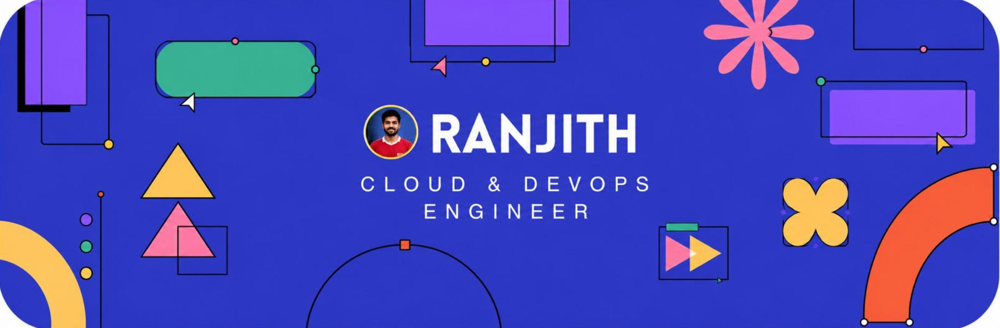
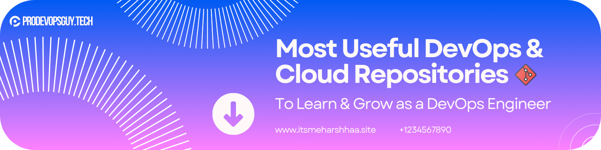

  <!-- Replace the src link below with the link to your top banner image -->
  

    

  <h1>R A N J I T H</h1>
  
  
<b>Development Platform, Automation & MLOps Enthusiast</b>

  
  

    <code>DevOps</code> · <code>MLOps</code> · <code>IDP</code> · <code>AI Infrastructure</code> · <code>Platform Engineering</code>
  

  
  
<em>Turning DevOps Complexity into Developer Simplicity</em>

  

    
    
    
    
    
    
  

  
<i>I build scalable cloud infrastructures, automate ML pipelines, and create Internal Developer Platforms that help engineering teams move faster. I publish open-source DevOps & MLOps tooling and create technical content for the community.</i>

---

## ⚡ Tech Stack

  <!-- Replace the src link below with the link to your Tech Stack banner image -->
  
   
    
  
  
  
  
  
  
  
  
  
  
  
  
  
  
  
  
  

---

## 📂 Featured Projects

  <!-- Replace the src link below with the link to your Projects banner image -->
  

### 🔧 DevOps & Infrastructure
<table align="center">
  <thead>
    <tr>
      <th colspan="2" align="center">BEGINNER</th>
    </tr>
    <tr>
      <th>Project</th>
      <th>Description</th>
    </tr>
  </thead>
  <tbody>
    <tr>
      <td><a href="#">DevOps Real-Time Projects</a></td>
      <td>Real-world projects, beginner → advanced</td>
    </tr>
    <tr>
     <td><a href="https://gumpiliranjith.github.io/GITPAGES_dep/">DEPLOYMENT</a></td>
      <td>Using Git-pages to deployment</td>
    </tr>
    <tr>
    <tr>
    <td><a href="https://yourdomain.com">AWS EC2 Static Website</a></td>
    <td>Hosted a static website on AWS EC2 with Ubuntu, Nginx, Route 53, HTTPS (Let's Encrypt), and automated deployment using CodePipeline.</td>
</tr>
    </tr>
  </tbody>
</table>

 

<table align="center">
  <thead>
    <tr>
      <th colspan="2" align="center">ADVANCE</th>
    </tr>
    <tr>
      <th>Project</th>
      <th>Description</th>
    </tr>
  </thead>
  <tbody>
    <tr>
      <td><a href="#">DevOps Real-Time Projects</a></td>
      <td>Real-world projects, beginner → advanced</td>
    </tr>
    <!-- Add more rows here -->
  </tbody>
</table>

## 🌐 Learning Hub

  <!-- Replace the src link below with the link to your Learning Hub banner image -->
  
    

| Resource | Description |
|----------|-------------|
| [📚 Docs Portal](#) | 900+ curated learning materials |
| [💻 Projects Hub](#) | Real-world hands-on projects |
| [🎓 K8s Learning](#) | Kubernetes from scratch → CKA |
| [🐳 Docker to Kubernetes](#) | Complete containerization journey |
| [⚙️ DevOps Generator](#) | DevOps project scaffolding |
| [☁️ AWS Infra Generator](#) | AWS infra templates & configs |
| [📊 Monitoring in a Box](#) | Prometheus · Grafana · Loki |

---

## 📊 GitHub Stats

  
  

## 🔗 Linkedin Stats

  

